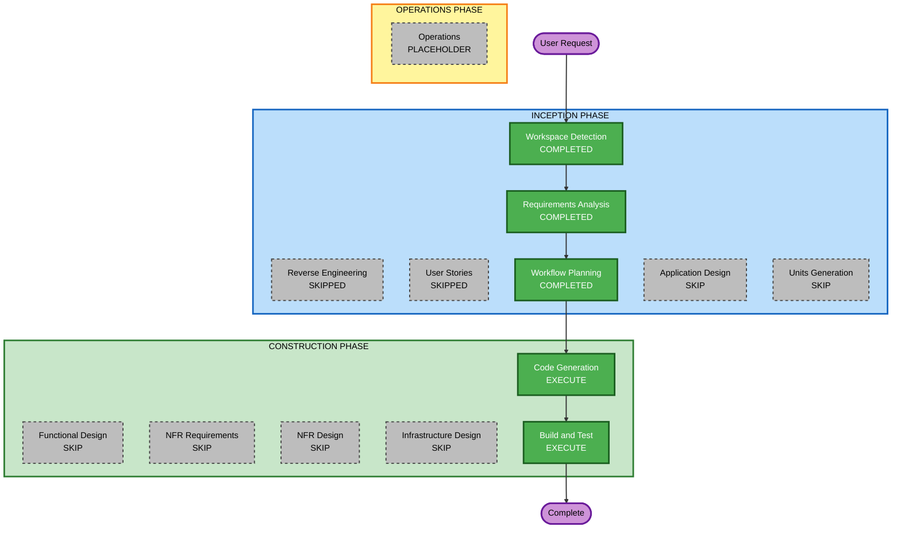

# Execution Plan — Task Manager REST API

## Detailed Analysis Summary

### Transformation Scope
- **Project Type**: Greenfield (sem código de aplicação pré-existente)
- **Transformation Type**: N/A — novo projeto
- **Primary Changes**: API REST CRUD completa para recurso `Task`

### Change Impact Assessment
| Área | Impacto | Descrição |
|------|---------|-----------|
| User-facing changes | Sim | API HTTP/JSON consumível por clientes |
| Structural changes | Sim | Nova estrutura `app/` + `tests/` |
| Data model changes | Sim | Nova tabela `Task` em SQLite |
| API changes | Sim | 5 endpoints REST novos |
| NFR impact | Baixo | Stack definida; sem requisitos de performance/escala |

### Risk Assessment
| Critério | Avaliação |
|----------|-----------|
| **Risk Level** | Baixo |
| **Rollback Complexity** | Fácil (projeto novo, sem produção) |
| **Testing Complexity** | Simples a moderada (pytest + TestClient) |

---

## Workflow Visualization

### Mermaid Diagram



### Text Alternative

```
INCEPTION PHASE
  Workspace Detection     → COMPLETED
  Reverse Engineering     → SKIPPED (greenfield)
  Requirements Analysis   → COMPLETED
  User Stories            → SKIPPED
  Workflow Planning       → COMPLETED
  Application Design      → SKIP
  Units Generation        → SKIP

CONSTRUCTION PHASE
  Functional Design       → SKIP
  NFR Requirements        → SKIP
  NFR Design              → SKIP
  Infrastructure Design   → SKIP
  Code Generation         → EXECUTE
  Build and Test          → EXECUTE

OPERATIONS PHASE
  Operations              → PLACEHOLDER
```

---

## Phases to Execute

### INCEPTION PHASE
- [x] Workspace Detection — **COMPLETED**
- [x] Reverse Engineering — **SKIPPED** (sem código de aplicação)
- [x] Requirements Analysis — **COMPLETED** (aprovado pelo usuário)
- [x] User Stories — **SKIPPED**
  - **Rationale**: API interna/PoC; requisitos e cenários já documentados em `requirements.md`; sem múltiplas personas
- [x] Workflow Planning — **COMPLETED**
- [ ] Application Design — **SKIP**
  - **Rationale**: Estrutura `app/`, modelo `Task` e endpoints já definidos nos requisitos; lógica de negócio simples
- [ ] Units Generation — **SKIP**
  - **Rationale**: Unidade única (`task-manager-api`); sem decomposição multi-serviço necessária

### CONSTRUCTION PHASE
- [ ] Functional Design — **SKIP**
  - **Rationale**: Regras de validação e fluxos CRUD já especificados (seções 3–6 de `requirements.md`)
- [ ] NFR Requirements — **SKIP**
  - **Rationale**: Stack e testes já escolhidos; extensões Security/Resiliency desabilitadas
- [ ] NFR Design — **SKIP**
  - **Rationale**: Depende de NFR Requirements (skipped)
- [ ] Infrastructure Design — **SKIP**
  - **Rationale**: SQLite local; sem infraestrutura cloud ou IaC
- [ ] Code Generation — **EXECUTE**
  - **Rationale**: Implementação da API, modelos, rotas, dependências e testes pytest
- [ ] Build and Test — **EXECUTE**
  - **Rationale**: Instruções de build, execução de testes e verificação dos critérios de aceite

### OPERATIONS PHASE
- [ ] Operations — **PLACEHOLDER**

---

## Unit of Work

**Nome**: `task-manager-api` (única unidade)

**Entregáveis**:
| Artefato | Caminho |
|----------|---------|
| App FastAPI | `app/main.py`, `app/routers/tasks.py` |
| Modelos SQLModel | `app/models.py` |
| Database layer | `app/database.py` |
| Dependências | `requirements.txt` |
| Testes | `tests/conftest.py`, `tests/test_tasks.py` |
| Documentação | `README.md` (atualizado) |

---

## Code Generation Plan (preview)

1. Criar `requirements.txt` (fastapi, sqlmodel, uvicorn, pytest, httpx)
2. Implementar `app/database.py` — engine SQLite via env var
3. Implementar `app/models.py` — `Task` table + schemas create/update/read
4. Implementar `app/routers/tasks.py` — 5 endpoints CRUD
5. Implementar `app/main.py` — lifespan, router, app factory
6. Implementar `tests/conftest.py` — DB em memória + TestClient
7. Implementar `tests/test_tasks.py` — cenários SC-01 a SC-09
8. Atualizar `README.md` com instruções de execução

---

## Estimated Timeline

| Fase | Estimativa |
|------|------------|
| Code Generation | 1 sessão |
| Build and Test | 1 sessão |
| **Total** | ~2 checkpoints |

---

## Success Criteria

- [ ] Todos os critérios de aceite de `requirements.md` §7 atendidos
- [ ] `pytest` passando sem falhas
- [ ] API executável via `uvicorn app.main:app`
- [ ] OpenAPI disponível em `/docs`

---

## References

- Requirements: `aidlc-docs/inception/requirements/requirements.md`
- State: `aidlc-docs/aidlc-state.md`
